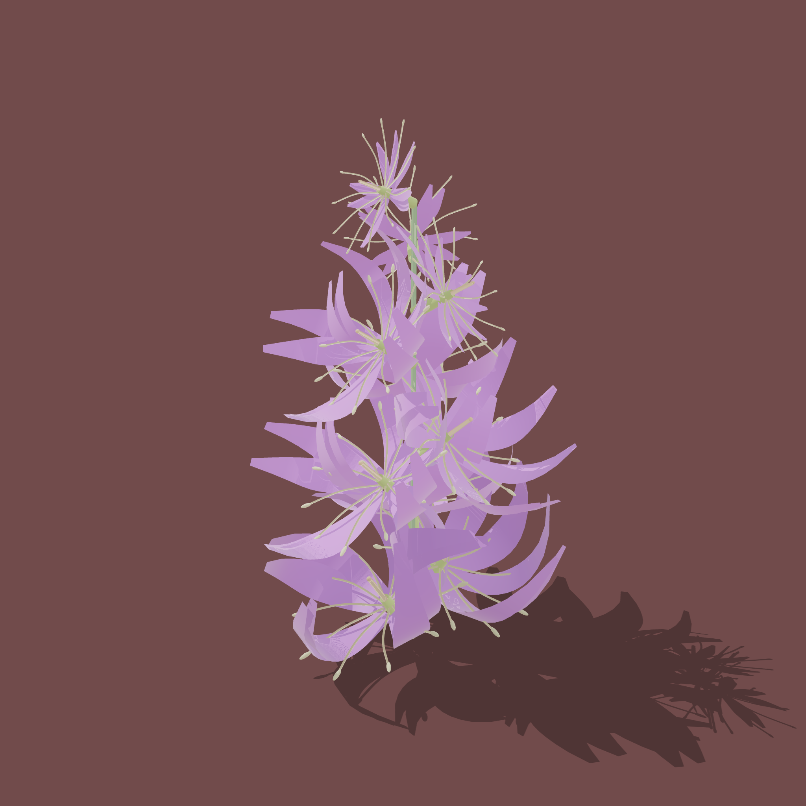
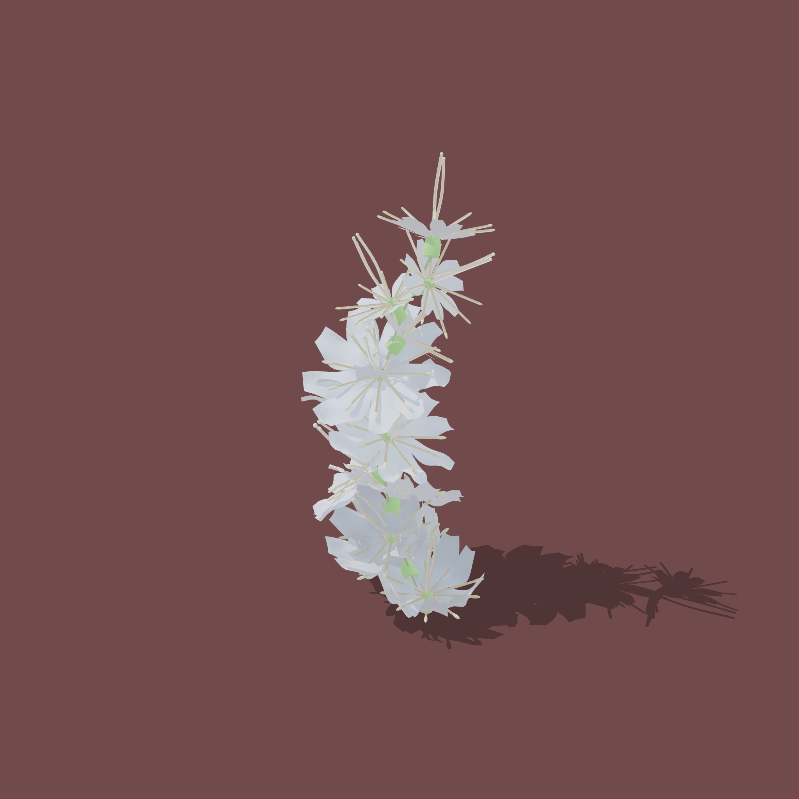

# Floraison

**Procedural 3D flower generation based on botanical principles**

Floraison is a web-based tool for generating botanically accurate 3D flowers using pure algorithmic approaches. Based on the SIGGRAPH 2005 paper by Ijiri et al., it uses floral diagrams and inflorescence patterns to create diverse flower models without manual editing.

## 🌸 [Try it Live](https://wally869.github.io/Floraison/)

## Gallery

<p align="center">
  
  
</p>

<p align="center">
  
  
</p>

## Features

- **Botanically structured**: Uses floral diagrams (pistil, stamen, petal, sepal arrangements) and inflorescence patterns (raceme, umbel, dichasium, etc.)
- **Purely procedural**: No manual mesh editing—all geometry generated from parameters
- **High-performance compute**: Rust core compiled to WebAssembly
- **Interactive preview**: Real-time 3D visualization with Three.js
- **glTF export**: Industry-standard format for use in other tools

## Tech Stack

- **Compute**: Rust → WebAssembly (wasm-bindgen)
- **Frontend**: SvelteKit + TailwindCSS
- **Rendering**: Three.js
- **Export**: glTF 2.0

## Project Status

🚧 In active development for the [Made with Claude](https://build.anthropic.com) contest

## Getting Started

### Prerequisites

- **Rust** (latest stable): [rustup.rs](https://rustup.rs)
- **Node.js** 18+ and npm 9+: [nodejs.org](https://nodejs.org)
- **wasm-pack**: `cargo install wasm-pack`
- **cargo-watch** (optional, for auto-rebuild): `cargo install cargo-watch`

### Quick Start

```bash
# Clone the repository
git clone https://github.com/anthropics/floraison
cd floraison

# Install dependencies
npm run setup

# Start development server (auto-rebuilds WASM + hot-reload UI)
npm run dev

# Open browser to http://localhost:5173
```

### Available Commands

**Development:**
```bash
npm run dev              # Start dev servers (WASM + UI with hot reload)
npm run dev:wasm         # Watch Rust files and rebuild WASM
npm run dev:ui           # Start UI dev server only
```

**Building:**
```bash
npm run build            # Production build (optimized WASM + UI)
npm run build:wasm       # Build WASM only
npm run build:ui         # Build UI only
```

**Testing:**
```bash
npm run test             # Run all tests (Rust + UI)
npm run test:rust        # Rust tests only
npm run test:ui          # UI tests only
```

**Code Quality:**
```bash
npm run check            # Type check all code
npm run format           # Format code (rustfmt + prettier)
npm run lint             # Lint code (clippy + eslint)
```

**Maintenance:**
```bash
npm run clean            # Remove build artifacts
```

### Project Structure

```
floraison/
├── floraison-core/          # Core math & geometry (Rust)
├── floraison-components/    # Flower component generators (Rust)
├── floraison-wasm/          # WASM bindings (Rust)
├── floraison-ui/            # Web UI (SvelteKit + TailwindCSS)
│   └── src/lib/wasm/        # Generated WASM output
├── docs/                    # Documentation
├── package.json             # Root npm scripts
└── Cargo.toml              # Rust workspace

```

### Development Workflow

1. **Make changes** to Rust code in `floraison-*/src/`
2. **WASM auto-rebuilds** (if `npm run dev` is running)
3. **UI hot-reloads** automatically in browser
4. **Test changes** with `npm run test`
5. **Format code** with `npm run format` before committing

## Documentation

- [User Guide](docs/USER_GUIDE.md) - Complete user manual with parameter reference and tips
- [Technical Overview](docs/TECHNICAL_OVERVIEW.md) - Architecture and implementation details
- [Implementation Roadmap](docs/ROADMAP.md) - Development plan and progress

## Reference

Based on: *Floral diagrams and inflorescences: Interactive flower modeling using botanical structural constraints*
Ijiri, Owada, Okabe, Igarashi (SIGGRAPH 2005)

## License

MIT
